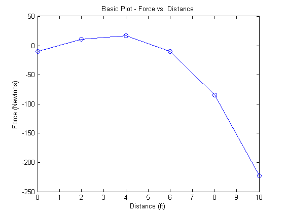
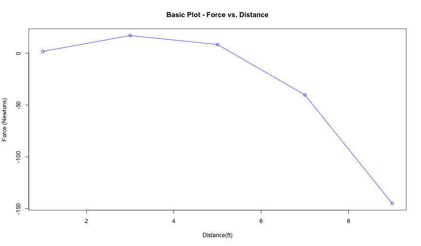
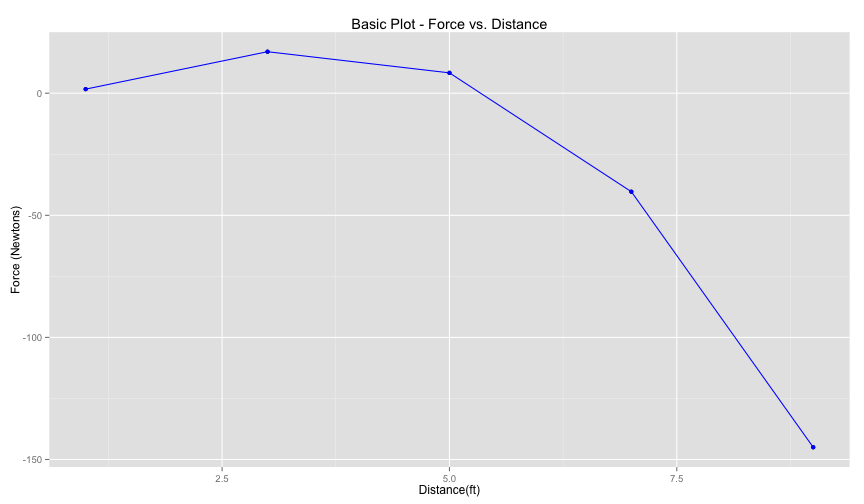
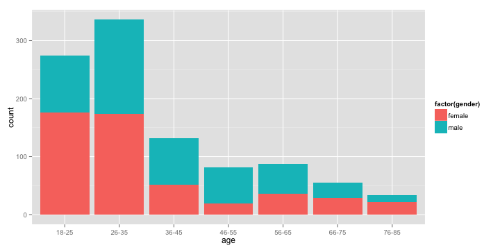

10 Reasons Why You Should Start Using R
========================================================
author: Gabriel Martins Dias
date: May 8th, 2015
transition: rotate
class: illustration

<!-- This is a comment line -->

What to expect from this presentation?
========================================================

* R for beginners
  * Features
  * Comparison with other tools
* Examples
  * Codes
  * Tools
  * Packages


What is R?
========================================================

According to [Wikipedia](http://en.wikipedia.org/wiki/R_%28programming_language%29):

> A **programming language** and software environment for **statistical computing** 
and graphics. 

> It is widely used among statisticians and data miners for 
**developing statistical software and data analysis**. 

> Its popularity has **increased substantially** in recent years.
 
Reason #1 - Community
========================================================
type:section

Reason #1 - Community
========================================================

 * Open source
 * Free
 * Huge community
 * Online resources
     * Courses
     * Forums

Reason #2 - The IDE
========================================================
type:section

Reason #2 - The IDE
========================================================

Pure R:


Reason #2 - The IDE
========================================================

RStudio:


<!-- In the following code chunk, the defaults for the whole document are defined. -->


Reason #3 - Style
========================================================
type:section

Reason #3 - Style
========================================================

Matlab:



Reason #3 - Style
====================================


 

Reason #3 - Style
====================================
 

Reason #3 - Style
====================================


```r
d <- read.csv("data/nettleton/data.csv", sep=";")
qplot(age, data = d, fill = factor(gender))
```

 

Source: Nettleton's data set


Reason #4 - Data manipulation
========================================================
type:section
