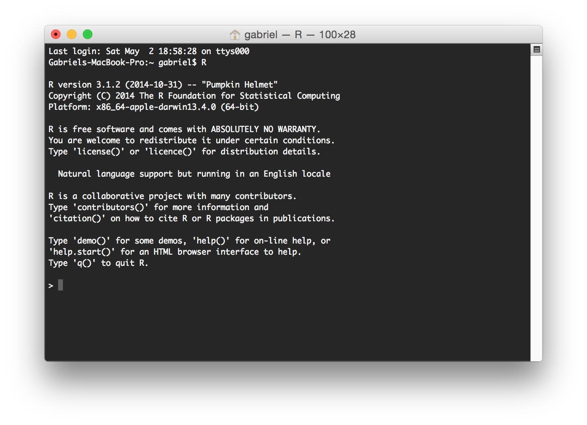
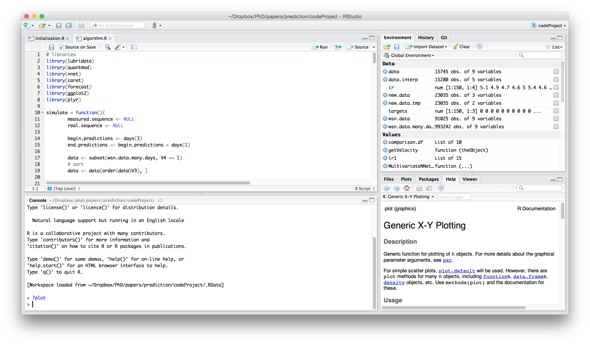
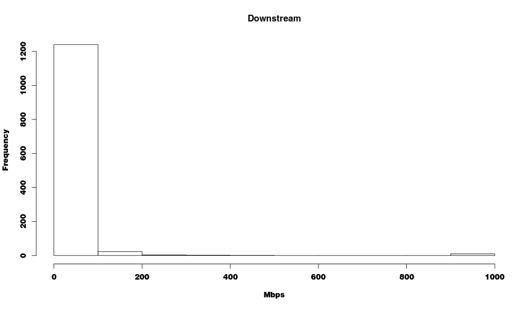

6 Reasons Why You Should Start Using R
========================================================
author: Gabriel Martins Dias
date: May 8th, 2015
transition: rotate
css: style.css

<!-- This is a comment line -->
<!-- In the following code chunk, the defaults for the whole document are defined. -->


What is R?
========================================================

According to [Wikipedia](http://en.wikipedia.org/wiki/R_%28programming_language%29):

> A **programming language** and software environment for **statistical computing** 
and graphics. 

> It is widely used among statisticians and data miners for 
**developing statistical software and data analysis**. 

> Its popularity has **increased substantially** in recent years.

What to expect from this presentation?
========================================================

* R for beginners
  * Features
  * Comparison with other tools
* Examples
  * Codes
  * Tools
  * Packages

Data sets used
========================================================

 1. __Activities in a store__

Data sets used
========================================================

### 1. Activities in a store


|colour.name   |colour.code |productid  |skuid         |
|:-------------|:-----------|:----------|:-------------|
|NEGRO         |#2c2b31     |6103880034 |8433815102928 |
|AVELLANA      |#E1D8D1     |6103870033 |8433815103376 |
|AVELLANA      |#E1D8D1     |1813659542 |8433815080622 |
|VERDE MANZANA |#65db80     |1333989684 |8433815097019 |
|MARENGO       |#595f6b     |1783619976 |8433815103338 |
|CARMIN        |#fe6557     |1333989684 |8433815097064 |

Data sets used
========================================================

 1. Activities in a store
 1. __Internet users around the world__

Data sets used
========================================================

### 2. Internet users around the world


|Country.Code |Country.Name.x |Indicator.Name                  |Indicator.Code | X1960|
|:------------|:--------------|:-------------------------------|:--------------|-----:|
|ABW          |Aruba          |Internet users (per 100 people) |IT.NET.USER.P2 |    NA|
|AFG          |Afghanistan    |Internet users (per 100 people) |IT.NET.USER.P2 |    NA|
|AGO          |Angola         |Internet users (per 100 people) |IT.NET.USER.P2 |    NA|
|ALB          |Albania        |Internet users (per 100 people) |IT.NET.USER.P2 |    NA|

_... it continues until 2013_

Data sets used
========================================================

 1. Activities in a store
 1. Internet users around the world
 1. __Internet services around the world__

Data sets used
========================================================

### 3. Internet services around the world


|Region |Country     |Technology |Product.name          | Downstream.bandwidth|Downstream.units |
|:------|:-----------|:----------|:---------------------|--------------------:|:----------------|
|Asia   |Afghanistan |ADSL       |DSL Shared Connection |                  128|Kbps             |
|Asia   |Afghanistan |ADSL       |DSL Shared Connection |                  256|Kbps             |
|Asia   |Afghanistan |ADSL       |DSL Shared Connection |                  512|Kbps             |
|Asia   |Afghanistan |ADSL       |DSL Shared Connection |                 1024|Kbps             |

Data sets used
========================================================

 1. Activities in a store
 1. Internet users around the world
 1. Internet services around the world
 1. __Activities in an online course__

Data sets used
========================================================

### 4. Activities in an online course


```
{
    "username": "---",
    "event_type": "load_video",
    "ip": "---",
    "agent": "Mozilla/5.0 (Windows NT 6.0) AppleWebKit/537.36 (KHTML, like Gecko) Chrome/37.0.2062.124 Safari/537.36",
    "host": "www.ucatx.cat",
    "session": "f689d6cd57bb0f68a1a8759fd251088d",
    "event": "{\"id\":\"i4x-UPF-C01-video-7ebca4d2e7164f6d944875cede5aa753\",\"code\":\"Eysn011TDjg\"}",
    "event_source": "browser",
    "context": {
        "username": "---",
        "user_id": 149,
        "ip": "---",
        "org_id": "UPF",
        "agent": "Mozilla/5.0 (Windows NT 6.0) AppleWebKit/537.36 (KHTML, like Gecko) Chrome/37.0.2062.124 Safari/537.36",
        "host": "www.ucatx.cat",
        "session": "f689d6cd57bb0f68a1a8759fd251088d",
        "course_id": "UPF/C01/2014",
        "path": "/event"
    },
    "time": "2014-09-29T17:19:25.295450+00:00",
    "page": "---"
}
```

Data sets used
========================================================

 1. Activities in a store
 1. Internet users around the world
 1. Internet services around the world
 1. Activities in an online course
 1. __Social media users__

Data sets used
========================================================

### 5. Social media users


|age   |gender |residence     |religion |maritalstatus |community |
|:-----|:------|:-------------|:--------|:-------------|:---------|
|26-35 |female |Boca Raton    |Muslim   |Single        |f         |
|18-25 |female |Boca Raton    |Jewish   |Single        |g         |
|66-75 |male   |Santa Barbara |Hindu    |Widowed       |d         |
|26-35 |female |Boca Raton    |Muslim   |Single        |f         |
|56-65 |female |Palo Alto     |Jewish   |Divorced      |e         |
|26-35 |female |Boca Raton    |Muslim   |Single        |f         |

<small>_11 different characteristics about each user **plus their community**_</small>


========================================================
type:alert

# 6 Reasons Why You 
# Should Start Using R

Reason #1 - Community
========================================================
type:section

Reason #1 - Community
========================================================
incremental:true

 * Open source
 * Free
 * Huge community
 * Online resources
     * Courses
     * Forums

Reason #2 - The IDE
========================================================
type:section

Reason #2 - The IDE
========================================================

Pure R:



Reason #2 - The IDE
========================================================

RStudio:




Reason #3 - Data Manipulation
========================================================
type:section

Reason #3 - Data Manipulation
========================================================

### Which Product is the Most Wanted?


|   |colour.name |colour.code |productid  |skuid         |
|:--|:-----------|:-----------|:----------|:-------------|
|57 |NEGRO       |#2c2b31     |6351140127 |635114012799  |
|58 |NEGRO       |#2c2b31     |6351120125 |635112012599  |
|59 |GRANATE     |#FF00FF     |6430610162 |643061016269  |
|60 |PERLA       |#BCBBC0     |1825939990 |8433815103871 |
|61 |PERLA       |#BCBBC0     |1825939990 |8433815123107 |
|62 |NEGRO       |#2c2b31     |6103920029 |8433815103444 |
|63 |INDIGO      |#517bd5     |5256939960 |525693996045  |
|64 |AZUL CIELO  |#90a6d2     |5256839716 |525683971641  |

Reason #3 - Data Manipulation
========================================================
incremental:true

## Which Product is the Most Wanted?

### **Tapply**

```r
# the number of sales per product
tries <- tapply(ds1$skuid, ds1$productid, length)
```


```r
# the product with more tries
tries[which(tries == max(tries))]
```

```
5860769906 
        35 
```

Reason #3 - Data Manipulation
========================================================
incremental:true

### Which Combination "Product + Color"?

```r
# number of sales per product and color
tries <- tapply(ds1$skuid, ds1[, c("productid", "colour.code")], length)

# the product with more sales
ind <- which(tries == max(tries, na.rm = TRUE), arr.ind=TRUE)
```


```
[1] "5256939958 #FF00FF" "5860719909 #FF00FF" "5860769906 #FF00FF"
```

Reason #3 - Data Manipulation
========================================================

### Which color?
<div style='background-color:#FF00FF; width=100px;height:100px;'>&nbsp;</div>


Reason #3 - Data Manipulation
========================================================


|   |Country.Name           |Country.Code |Indicator.Name                  |Indicator.Code | X1960|
|:--|:----------------------|:------------|:-------------------------------|:--------------|-----:|
|23 |Bosnia and Herzegovina |BIH          |Internet users (per 100 people) |IT.NET.USER.P2 |    NA|


|   |Country.Name           |Country.Code |Region                |IncomeGroup         |SpecialNotes                                                                                     |
|:--|:----------------------|:------------|:---------------------|:-------------------|:------------------------------------------------------------------------------------------------|
|24 |Bosnia and Herzegovina |BIH          |Europe & Central Asia |Upper middle income |Based on official government statistics for chain linked series; the new reference year is 2010. |

Reason #3 - Data Manipulation
========================================================
incremental:true

## What is the European Country with the Greatest % of Users in 2013?

### **Merge**


```r
ds2 <- merge(ds2.p1, ds2.p2, by = "Country.Code")
```

### **Subset**


```r
europeans <- subset(ds2, Region == "Europe & Central Asia")
```


```r
order.ind <- order(as.numeric(europeans$X2013), decreasing = T)
```


```r
europeans[order.ind, ]
```

Reason #3 - Data Manipulation
========================================================


|    |Country.Code |Country.Name.x |   X2013|
|:---|:------------|:--------------|-------:|
|105 |ISL          |Iceland        | 96.5468|
|168 |NOR          |Norway         | 95.0534|
|212 |SWE          |Sweden         | 94.7836|
|57  |DNK          |Denmark        | 94.6297|
|5   |AND          |Andorra        | 94.0000|
|166 |NLD          |Netherlands    | 93.9564|
|128 |LIE          |Liechtenstein  | 93.8000|
|134 |LUX          |Luxembourg     | 93.7765|
|73  |FIN          |Finland        | 91.5144|
|139 |MCO          |Monaco         | 90.7000|

Reason #4 - Data Visualization
========================================================
type:section

Reason #4 - Data Visualization
========================================================


```r
pairs(ds2.obs)
```

 

Reason #4 - Data Visualization
========================================================

### 3. Internet services around the world


|Region |Country     |Technology |Product.name          | Downstream.bandwidth|Downstream.units |
|:------|:-----------|:----------|:---------------------|--------------------:|:----------------|
|Asia   |Afghanistan |ADSL       |DSL Shared Connection |                  128|Kbps             |
|Asia   |Afghanistan |ADSL       |DSL Shared Connection |                  256|Kbps             |
|Asia   |Afghanistan |ADSL       |DSL Shared Connection |                  512|Kbps             |
|Asia   |Afghanistan |ADSL       |DSL Shared Connection |                 1024|Kbps             |

Reason #4 - Data Visualization
========================================================


## How is the Internet Service in Spain?


```r
pairs(subset(ds3, Technology != "" & Date.tariff.recorded == "2012Q3" & Country.Name.x == "Spain")[cols])
```

 

Reason #4 - Data Visualization
========================================================

## How is the Internet Service in USA?


```r
pairs(subset(ds3, Technology != "" & Date.tariff.recorded == "2012Q3" & Country.Name.x == "United States")[cols])
```

 

Reason #4 - Data Visualization
========================================================


```r
hist(ds3$Downstream..Mbps., xlab = "Mbps", main = "Downstream")
```

 


Reason #4 - Data Visualization
========================================================

### 4. Activities in an online course


```
{
    "username": "---",
    "event_type": "load_video",
    "ip": "---",
    "agent": "Mozilla/5.0 (Windows NT 6.0) AppleWebKit/537.36 (KHTML, like Gecko) Chrome/37.0.2062.124 Safari/537.36",
    "host": "www.ucatx.cat",
    "session": "f689d6cd57bb0f68a1a8759fd251088d",
    "event": "{\"id\":\"i4x-UPF-C01-video-7ebca4d2e7164f6d944875cede5aa753\",\"code\":\"Eysn011TDjg\"}",
    "event_source": "browser",
    "context": {
        "username": "---",
        "user_id": 149,
        "ip": "---",
        "org_id": "UPF",
        "agent": "Mozilla/5.0 (Windows NT 6.0) AppleWebKit/537.36 (KHTML, like Gecko) Chrome/37.0.2062.124 Safari/537.36",
        "host": "www.ucatx.cat",
        "session": "f689d6cd57bb0f68a1a8759fd251088d",
        "course_id": "UPF/C01/2014",
        "path": "/event"
    },
    "time": "2014-09-29T17:19:25.295450+00:00",
    "page": "---"
}
```

Reason #4 - Data Visualization
========================================================


```r
qplot(data = subset(ds4, 
                event_source == "browser" & # events from browser
                grep("video", event_type) & # only video playings
                !is.na(time)), # with information about the time
      x = as.character(floor(minute(time) / 15)+1), # split the hour
      xlab = "quarter of hour", main = "Video actions in an hour")
```

 

Reason #4 - Data Visualization
========================================================


```r
qplot(data = subset(ds4, 
                event_source == "browser" & # events from browser
                grep("video", event_type) & # only video playings
                !is.na(time)), # with information about the time
      x = as.character(floor(minute(time) / 15) + 1), # split the hour
      xlab = "quarter of hour", main = "Video actions per user",
      facets = username ~ .)
```

Reason #4 - Data Visualization
========================================================

 

Reason #4 - Data Visualization
========================================================


```r
qplot(data = subset(ds4, 
                event_source == "browser" & # events from browser
                grep("video", event_type) & # only video playings
                !is.na(time) & # with information about the time
                username == "6"), 
      x = as.character(floor(minute(time) / 15) + 1), # split the hour
      xlab = "quarter of hour", main = "Video actions of user #6",
      fill = event_type)
```

Reason #4 - Data Visualization
========================================================

 

Reason #4 - Data Visualization
========================================================

### 5. Social media users


|age   |gender |residence     |religion |maritalstatus |community |
|:-----|:------|:-------------|:--------|:-------------|:---------|
|26-35 |female |Boca Raton    |Muslim   |Single        |f         |
|18-25 |female |Boca Raton    |Jewish   |Single        |g         |
|66-75 |male   |Santa Barbara |Hindu    |Widowed       |d         |
|26-35 |female |Boca Raton    |Muslim   |Single        |f         |
|56-65 |female |Palo Alto     |Jewish   |Divorced      |e         |
|26-35 |female |Boca Raton    |Muslim   |Single        |f         |

<small>_11 different characteristics about each user **plus their community**_</small>

Reason #4 - Data Visualization
====================================


```r
qplot(age, 
      data = ds5, 
      fill = factor(gender), 
      position="dodge", 
      main = "Number of people grouped by age interval")
```

 

Reason #5 - Predictions
========================================================
type:section

Reason #5 - Predictions
========================================================


|age   |gender |residence     |religion  |maritalstatus |community |
|:-----|:------|:-------------|:---------|:-------------|:---------|
|26-35 |female |Boca Raton    |Muslim    |Single        |f         |
|18-25 |female |Boca Raton    |Jewish    |Single        |g         |
|66-75 |male   |Santa Barbara |Hindu     |Widowed       |d         |
|26-35 |female |Boca Raton    |Muslim    |Single        |f         |
|56-65 |female |Palo Alto     |Jewish    |Divorced      |e         |
|26-35 |female |Boca Raton    |Muslim    |Single        |f         |
|26-35 |female |Norfolk       |Buddhist  |Divorced      |c         |
|18-25 |female |Boca Raton    |Christian |Single        |i         |
|46-55 |male   |Santa Barbara |Christian |Single        |e         |
|56-65 |male   |Santa Barbara |Hindu     |Widowed       |j         |

Reason #5 - Predictions
========================================================

### Training
<!-- html table generated in R 3.2.0 by xtable 1.7-4 package -->
<!-- Thu May  7 21:04:38 2015 -->
<table border=1>
<tr> <th> age </th> <th> gender </th> <th> residence </th> <th> religion </th> <th> maritalstatus </th> <th> community </th>  </tr>
  <tr> <td> 26-35 </td> <td> female </td> <td> Boca Raton </td> <td> Muslim </td> <td> Single </td> <td> f </td> </tr>
  <tr> <td> 18-25 </td> <td> female </td> <td> Boca Raton </td> <td> Jewish </td> <td> Single </td> <td> g </td> </tr>
  <tr> <td> 66-75 </td> <td> male </td> <td> Santa Barbara </td> <td> Hindu </td> <td> Widowed </td> <td> d </td> </tr>
  <tr> <td> 26-35 </td> <td> female </td> <td> Boca Raton </td> <td> Muslim </td> <td> Single </td> <td> f </td> </tr>
  <tr> <td> 56-65 </td> <td> female </td> <td> Palo Alto </td> <td> Jewish </td> <td> Divorced </td> <td> e </td> </tr>
  <tr> <td> 26-35 </td> <td> female </td> <td> Boca Raton </td> <td> Muslim </td> <td> Single </td> <td> f </td> </tr>
  <tr> <td> 26-35 </td> <td> female </td> <td> Norfolk </td> <td> Buddhist </td> <td> Divorced </td> <td> c </td> </tr>
  <tr> <td> 18-25 </td> <td> female </td> <td> Boca Raton </td> <td> Christian </td> <td> Single </td> <td> i </td> </tr>
   </table>

Reason #5 - Predictions
========================================================

### Training
<!-- html table generated in R 3.2.0 by xtable 1.7-4 package -->
<!-- Thu May  7 21:04:38 2015 -->
<table border=1>
<tr> <th> age </th> <th> gender </th> <th> residence </th> <th> religion </th> <th> maritalstatus </th> <th> community </th>  </tr>
  <tr> <td> 26-35 </td> <td> female </td> <td> Boca Raton </td> <td> Muslim </td> <td> Single </td> <td> f </td> </tr>
  <tr> <td> 18-25 </td> <td> female </td> <td> Boca Raton </td> <td> Jewish </td> <td> Single </td> <td> g </td> </tr>
  <tr> <td> 66-75 </td> <td> male </td> <td> Santa Barbara </td> <td> Hindu </td> <td> Widowed </td> <td> d </td> </tr>
  <tr> <td> 26-35 </td> <td> female </td> <td> Boca Raton </td> <td> Muslim </td> <td> Single </td> <td> f </td> </tr>
  <tr> <td> 56-65 </td> <td> female </td> <td> Palo Alto </td> <td> Jewish </td> <td> Divorced </td> <td> e </td> </tr>
  <tr> <td> 26-35 </td> <td> female </td> <td> Boca Raton </td> <td> Muslim </td> <td> Single </td> <td> f </td> </tr>
  <tr> <td> 26-35 </td> <td> female </td> <td> Norfolk </td> <td> Buddhist </td> <td> Divorced </td> <td> c </td> </tr>
  <tr> <td> 18-25 </td> <td> female </td> <td> Boca Raton </td> <td> Christian </td> <td> Single </td> <td> i </td> </tr>
   </table>

### Testing
<!-- html table generated in R 3.2.0 by xtable 1.7-4 package -->
<!-- Thu May  7 21:04:38 2015 -->
<table border=1>
<tr> <th> age </th> <th> gender </th> <th> residence </th> <th> religion </th> <th> maritalstatus </th> <th> community </th>  </tr>
  <tr> <td> 46-55 </td> <td> male </td> <td> Santa Barbara </td> <td> Christian </td> <td> Single </td> <td> e </td> </tr>
  <tr> <td> 56-65 </td> <td> male </td> <td> Santa Barbara </td> <td> Hindu </td> <td> Widowed </td> <td> j </td> </tr>
   </table>

Reason #5 - Predictions
========================================================

### **Data Partition**

```r
# create 2 partitions
indicesTrain <- createDataPartition(y = ds5$community, p=0.8, list=FALSE)

#for training 
training <- ds5[indicesTrain,]

#for testing the predictions
testing <- ds5[-indicesTrain,]
```

Reason #5 - Predictions
========================================================

## Can we Discover a Person's Community based on their Interests?

### **Cross validation**

```r
model <- train(community ~ ., data = training, method = "rf",
               # for the cross validation
               trControl=trainControl(method="cv",number=5), 
               # allow proximity calculation -- used to plot importance
                prox=TRUE)
```


```r
# test the model
predictions <- predict(model, testing)

# show results
confusionMatrix(predictions, testing$community)
```

Reason #5 - Predictions
========================================================

## Results by Try

```
          Reference
Prediction  a  b  c  d  e  f  g  h  i  j
         a 40  1  1  1  0  0  0  0  0  0
         b  1 31  0  0  0  0  0  0  0  0
         c  1  1 40  0  0  1  0  0  0  0
         d  0  0  0 17  0  0  0  0  0  0
         e  0  0  0  1 15  0  0  0  0  0
         f  1  0  1  0  0 28  1  0  1  0
         g  0  0  0  0  0  0  3  0  0  0
         h  0  0  0  0  0  0  0  1  0  0
         i  0  1  0  0  1  2  0  0  4  0
         j  0  0  0  0  0  0  0  0  0  1
```

Reason #5 - Predictions
========================================================

## Results by Class

```
         Sensitivity Specificity Pos Pred Value Neg Pred Value  Prevalence
Class: a   0.9302326   0.9803922      0.9302326      0.9803922 0.219387755
Class: b   0.9117647   0.9938272      0.9687500      0.9817073 0.173469388
Class: c   0.9523810   0.9805195      0.9302326      0.9869281 0.214285714
Class: d   0.8947368   1.0000000      1.0000000      0.9888268 0.096938776
Class: e   0.9375000   0.9944444      0.9375000      0.9944444 0.081632653
Class: f   0.9032258   0.9757576      0.8750000      0.9817073 0.158163265
Class: g   0.7500000   1.0000000      1.0000000      0.9948187 0.020408163
Class: h   1.0000000   1.0000000      1.0000000      1.0000000 0.005102041
Class: i   0.8000000   0.9790576      0.5000000      0.9946809 0.025510204
Class: j   1.0000000   1.0000000      1.0000000      1.0000000 0.005102041
         Detection Rate Detection Prevalence Balanced Accuracy
Class: a    0.204081633          0.219387755         0.9553124
Class: b    0.158163265          0.163265306         0.9527959
Class: c    0.204081633          0.219387755         0.9664502
Class: d    0.086734694          0.086734694         0.9473684
Class: e    0.076530612          0.081632653         0.9659722
Class: f    0.142857143          0.163265306         0.9394917
Class: g    0.015306122          0.015306122         0.8750000
Class: h    0.005102041          0.005102041         1.0000000
Class: i    0.020408163          0.040816327         0.8895288
Class: j    0.005102041          0.005102041         1.0000000
```

Reason #5 - Predictions
========================================================

## Overall Results
 * Accuracy :  0.9183673 
 * Kappa :  0.9021468 
 * AccuracyLower :  0.870818 
 * AccuracyUpper :  0.9526202 
 * AccuracyNull :  0.2193878 
 * AccuracyPValue :  6.171417e-98 
 * McnemarPValue :  NaN 

Reason #5 - Predictions
========================================================

## Can we Know Which are the Most Relevant Variables?


```r
# plot the variable importance
varImpPlot(model$finalModel, n.var = 10, main ="Variable importance")
```

 

Reason #6 - Dissemination of Results
========================================================
type:section


Reason #6 - Dissemination of Results
========================================================

* **Reports**

Reason #6 - Dissemination of Results
========================================================

* Reports
* **Applications**

Reason #6 - Dissemination of Results
========================================================

* Reports
* Applications
* **Presentations**


Why You Should Start Using R
========================================================

 1. Community
 1. The IDE
 1. Data Manipulation
 1. Data Visualization
 1. Predictions
 1. Dissemination of Results

References
========================================================

<cite>D. F. Nettleton, “Generating synthetic online social network graph
data and topologies,” 3rd Workshop on Graph-based Technologies and
Applications (Graph-TA), UPC, Barcelona, Spain, March 18-th 2015.<cite>

Special Thanks
========================================================

 * [Anna Carreras](https://scholar.google.es/citations?user=wbD9AGgAAAAJ)
 * [Manuel Palacin](http://www.nets.upf.edu/node/314)
 * [Albert Domingo](https://scholar.google.es/citations?user=rlGr0TwAAAAJ)
 * [Miquel Oliver](https://scholar.google.es/citations?user=KswY7uUAAAAJ)
 * [David Nettleton](https://scholar.google.com/citations?user=bnS_CxMAAAAJ)

Why You Should Start Using R
========================================================

 1. Community
 1. The IDE
 1. Data Manipulation
 1. Data Visualization
 1. Predictions
 1. Dissemination of Results
