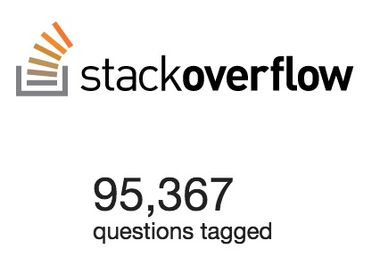
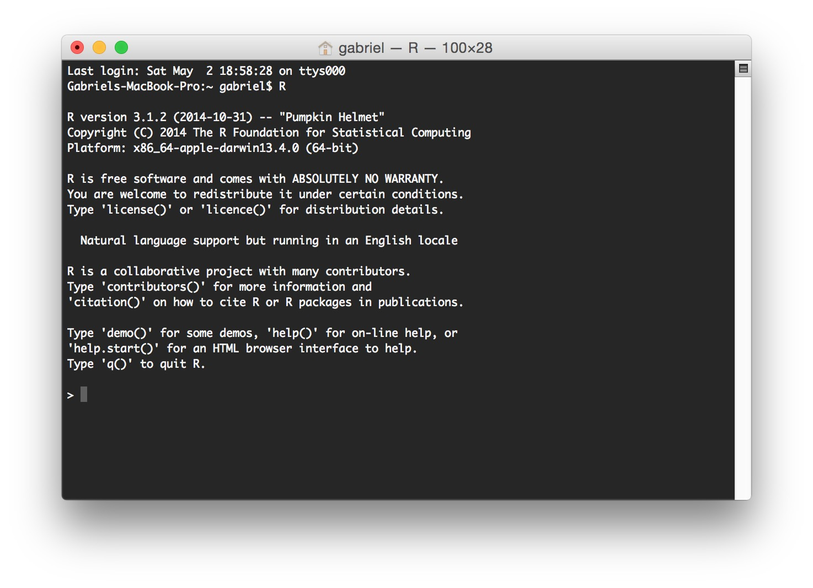
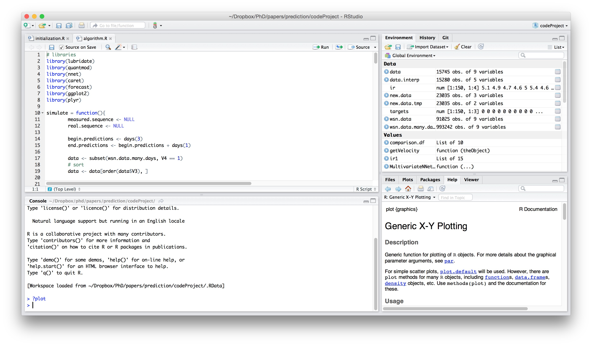

<!-- This is a comment line -->
<!-- In the following code chunk, the defaults for the whole document are defined. -->

```{r setup, include=FALSE}
# cache the code chucks in order to speed up the creation
knitr::opts_chunk$set(cache=TRUE)

# load libraries
library(ggplot2)
library(xlsx)
library(jsonlite)
library(manipulate)
library(lubridate)
library(caret)
library(plyr)
library(xtable)
library(pander)

#disable warnings
options(warn=-1)
```

What is R?
========================================================

## What is R?

### According to [Wikipedia](http://en.wikipedia.org/wiki/R_%28programming_language%29):

> A **programming language** and software environment for **statistical computing** 
and graphics. 

> It is widely used among statisticians and data miners for 
**developing statistical software and data analysis**. 

> Its popularity has **increased substantially** in recent years.

## What is R?

### According to [R Foundation](http://www.r-project.org/):

> An **integrated suite** of software facilities for **data manipulation**, **calculation** and **graphical display**.

What to expect from this presentation?
========================================================

## What to expect from this presentation?

 * R for beginners
      + Features
 * Examples
      + Code
      + Tools
      + Packages

## Data sets

## Data sets

 1. __Activities in a store__

## Data sets

```{r, echo = FALSE}
ds1 <- read.xlsx("data/carreras/data.xlsx", sheetIndex = 1)

# interpret the JSON part
ds1.json <- mapply(fromJSON, as.character(ds1$productdata))
```

```{r, echo = FALSE}
ds1.json <- lapply(ds1.json, function(list.item){ 
                data.frame(colour.name = list.item$colour$name, 
                           colour.code = list.item$colour$code)
        } )
ds1.df <- do.call(rbind, ds1.json)

# add a new column
ds1.df$productid <- ds1$productid
ds1.df$skuid <- ds1$skuid

rownames(ds1.df) <- 1:nrow(ds1)
ds1 <- ds1.df
pander(head(ds1, 6), style = "simple", caption = "Activities in a store")
```

## Data sets

 1. Activities in a store
 1. __Internet users around the world__

## Data sets

```{r, echo = FALSE}
ds2.p1 <- read.xlsx("data/palacin/data.xls", sheetIndex = 1, startRow = 3)
ds2.p2 <- read.xlsx("data/palacin/data.xls", sheetIndex = 2, startRow = 1)
ds2 <- merge(ds2.p1, ds2.p2, by = "Country.Code")
pander(head(ds2[, 2:5], 4), "Internet users around the world")
```

_... it continues until 2013_

## Data sets

 1. Activities in a store
 1. Internet users around the world
 1. __Internet services around the world__

## Data sets

```{r, echo = FALSE}
ds3 <- read.csv("data/domingo/data.csv")
ds3 <- ds3[,-3] # remove the company names
pander(ds3[1:4, c(1:3, 6)], "Internet services around the world")
```

## Data sets

 1. Activities in a store
 1. Internet users around the world
 1. Internet services around the world
 1. __Activities in an online course__

## Data sets

### 4. Activities in an online course

<pre style="font-size:0.7em; word-wrap:break-word; width:100%; line-height:1em;">
```{r, echo = FALSE, results='asis'}
con <- file("data/oliver/tracking-20140929-1412025421.log", open = "r", blocking = FALSE)
lines <- readLines(con)
close(con)

# remove sensory data
line <- gsub("username\"\\: \"(\\w*)\",", "username\": \"---\",", lines[200])
line <- gsub("ip\"\\: \"\\d{1,3}\\.\\d{1,3}\\.\\d{1,3}\\.\\d{1,3}\",", "ip\": \"---\",", line)
line <- gsub("page\"\\: \"(.*)\"", "page\": \"---\"", line)

print(prettify(line))
```
</pre>

## Data sets

 1. Activities in a store
 1. Internet users around the world
 1. Internet services around the world
 1. Activities in an online course
 1. __Movies__

## Data sets

```{r, echo = FALSE}
ds6.movies <- read.table("data/recalde/u.item", sep="|", quote = "", row.names = NULL)
ds6.genre <- read.table("data/recalde/u.genre", sep="|", quote = "", row.names = 1)

# let us set the column names
names(ds6.movies) <- c("movie", "title", "launch", "x", "imdb", rownames(ds6.genre))

pander(as.matrix(ds6.movies[c(1, 10, 44, 371, 558, 1133), c(1, 2, 11, 14)], rownames.force = FALSE), caption = "Movies")
```

<small>_18 different genders_</small>

## Data sets

```{r, echo = FALSE}
ds6 <- read.table("data/recalde/u1.base")
ds6.test <- read.table("data/recalde/u1.test")

# column names
names(ds6) <- c("user", "movie", "rating", "location")
names(ds6.test) <- c("user", "movie", "rating", "location")

pander(as.matrix(ds6[c(1, 10, 200, 230, 300, 310), 1:3], rownames.force = FALSE), "Users' ratings")
```

# 6 Reasons Why You Should Start Using R

# Reason #1 - Community

## Reason #1 - Community

<div class="columns-2">
 * Open source
 * Free
 * Huge community
 * Online resources
     * Courses
     * Forums

<br />
<div>

</div>
</div>

# Reason #2 - The IDE

## Reason #2 - The IDE

### Pure R:



## Reason #2 - The IDE

### RStudio:



# Reason #3 - Data Manipulation

## Reason #3 - Data Manipulation

### Which product is the most wanted?

## Reason #3 - Data Manipulation

### Which product is the most wanted?

```{r, echo = FALSE}
pander(ds1[57:62,])
```

## Reason #3 - Data Manipulation

### Which product is the most wanted?

> #### **Tapply**

## Reason #3 - Data Manipulation

### Which product is the most wanted?

> #### **Tapply**

```{r, class="fragment"}
# the number of tries per product
tries <- tapply(ds1$skuid, # list of items
                
                # categories
                ds1$productid, 
                
                #function to apply
                length)
```

## Reason #3 - Data Manipulation

### Which product is the most wanted?

> #### **Tapply**

```{r, class="fragment"}
# the number of tries per product
tries <- tapply(ds1$skuid, # list of items
                
                # categories
                ds1$productid, 
                
                #function to apply
                length)
```

```{r, class="fragment"}
# the product with more tries
tries[tries == max(tries)]
```

## Reason #3 - Data Manipulation

### Which combination "Product + Color"?

```{r}
# number of tries per product and color
tries <- tapply(ds1$skuid, # list of items
                
                # categories
                ds1[, c("productid", "colour.code")], 
                
                # function to apply
                length)
```

## Reason #3 - Data Manipulation

### Which combination "Product + Color"?

```{r}
# number of tries per product and color
tries <- tapply(ds1$skuid, # list of items
                
                # categories
                ds1[, c("productid", "colour.code")], 
                
                # function to apply
                length)

# the product with more tries
ind <- which(tries == max(tries, na.rm = TRUE), arr.ind=TRUE)
```

## Reason #3 - Data Manipulation

```{r, echo = FALSE}
df.products <- data.frame(item = rownames(tries)[ind[,1]], color = colnames(tries)[ind[,2]])
# the products were the following
pander(as.matrix(df.products, rownames.force = FALSE), caption = "Top Products and Colors")
```

## Reason #3 - Data Manipulation

```{r, echo = FALSE}
# the products were the following
pander(as.matrix(df.products, rownames.force = FALSE), caption = "Top Products and Colors")
```

### Which color?
```{r, echo = FALSE, results="asis"}
# this will print only the color of the product
cat(paste0("<div style='background-color:", colnames(tries)[ind[1,2]], "; width=100px;height:100px;'>&nbsp;</div>"))
```


## Reason #3 - Data Manipulation

```{r, echo = FALSE}
pander(as.matrix(ds2.p1[40:41, c(1,3,58)], rownames.force = FALSE), caption = "Data")
```

<br />  
  
```{r, echo = FALSE}
pander(as.matrix(ds2.p2[41:42, c(1,3,4)], rownames.force = FALSE), caption = "Metadata")
```

## Reason #3 - Data Manipulation

### What was the European country with the greatest % of users in 2013?

## Reason #3 - Data Manipulation

### What was the European country with the greatest % of users in 2013?

#### **Merge**

```{r, eval = FALSE}
ds2 <- merge(ds2.p1, ds2.p2, by = "Country.Code")
```

## Reason #3 - Data Manipulation

### What was the European country with the greatest % of users in 2013?

#### **Merge**

```{r, eval = FALSE}
ds2 <- merge(ds2.p1, ds2.p2, by = "Country.Code")
```

### **Subset**

```{r}
european <- subset(ds2, Region == "Europe & Central Asia")
```

## Reason #3 - Data Manipulation

### What was the European country with the greatest % of users in 2013?

#### **Merge**

```{r, eval = FALSE}
ds2 <- merge(ds2.p1, ds2.p2, by = "Country.Code")
```

### **Subset**

```{r}
european <- subset(ds2, Region == "Europe & Central Asia")
```

```{r}
order.ind <- order(as.numeric(european$X2013), decreasing = T)
```

```{r, eval = FALSE}
european[order.ind, ]
```

## Reason #3 - Data Manipulation

```{r, echo = FALSE}
pander(european[order.ind[1:9], c(1,2,58)])
```

# Reason #4 - Data Visualization

## Reason #4 - Data Visualization

```{r, echo = FALSE}
ds2$IncomeGroup <- factor(ds2$IncomeGroup, levels = c("Low income", "Lower middle income", "Upper middle income", "High income: nonOECD", "High income: OECD"))
# removing some information
ds2.obs <- ds2[,c("X1995", "X2012", "X2013", "IncomeGroup")]
```

```{r, fig.width=8, fig.height=5}
pairs(ds2.obs)
```

## Reason #4 - Data Visualization

```{r, echo = FALSE}
pander(as.matrix(ds3[c(1400,50,70,300,700,104,120,170), c(1:3, 6)], rownames.force = FALSE), "Internet services around the world")
```

## Reason #4 - Data Visualization

### How is the internet service in Spain?

```{r, echo = FALSE}
sort.technologies <- tapply(ds3$Downstream..Mbps., ds3$Technology, mean)
ds3$Technology <- factor(ds3$Technology, levels = levels(ds3$Technology)[order(sort.technologies)])

factor.mbps <- rep(0, nrow(ds3))
factor.mbps[ds3$Upstream.units == "Gbps"] <- 1000
factor.mbps[ds3$Upstream.units == "Mbps"] <- 1
factor.mbps[ds3$Upstream.units == "Kbps"] <- 0.001

ds3$Upstream.Mbps <- factor.mbps * as.numeric(ds3$Upstream.bandwidth)

# merge with previous data set
ds3 <- merge(ds2, ds3, by.x = "Country.Name.x", by.y = "Country")
cols <- c("Technology", "VAT.Rate", "Connection.charge..local.currency.", "Downstream..Mbps.", "Upstream.Mbps", "Monthly.cost..US..")
```

```{r, fig.width=8, fig.height=5, eval= FALSE}
pairs(subset(ds3, Technology != "" & 
                  Date.tariff.recorded == "2012Q3" &
                  Country.Name.x == "Spain")[cols])
```

## Reason #4 - Data Visualization

### How is the internet service in Spain?

```{r, fig.width=8, fig.height=5, echo= FALSE}
pairs(subset(ds3, Technology != "" & 
                  Date.tariff.recorded == "2012Q3" &
                  Country.Name.x == "Spain")[cols])
```

## Reason #4 - Data Visualization

```{r, fig.width=8, fig.height=5}
hist(ds3$Downstream..Mbps., xlab = "Mbps", main = "Downstream")
```

```{r, eval = FALSE, echo=FALSE}

plot.ds3 <- function(max.mbps, threshold){
        # draw the histogram
        with( subset(ds3, Downstream..Mbps. <= max.mbps), hist(Downstream..Mbps.)) 
        # draw the red line
        abline(h = threshold, col="red")
}

manipulate( plot.ds3(max.mbps, threshold),
            max.mbps = slider( min(ds3$Downstream..Mbps.), 
                        max(ds3$Downstream..Mbps.), 
                        initial = max(ds3$Downstream..Mbps.)),
            threshold = slider(1, 1000))
```

## Reason #4 - Data Visualization

### 4. Activities in an online course

<pre style="font-size:0.7em; word-wrap:break-word; width:100%; line-height:1em;">
```{r, echo = FALSE, results='asis'}
con <- file("data/oliver/tracking-20140929-1412025421.log", open = "r", blocking = FALSE)
lines <- readLines(con)
close(con)

# remove sensory data
line <- gsub("username\"\\: \"(\\w*)\",", "username\": \"---\",", lines[200])
line <- gsub("ip\"\\: \"\\d{1,3}\\.\\d{1,3}\\.\\d{1,3}\\.\\d{1,3}\",", "ip\": \"---\",", line)
line <- gsub("page\"\\: \"(.*)\"", "page\": \"---\"", line)

prettify(line)
```
</pre>

## Reason #4 - Data Visualization

```{r, echo = FALSE}
con <- file("data/oliver/tracking-20140929-1412025421.log", open = "r", blocking = FALSE)
lines <- readLines(con)
close(con)

# choose only lines with valid JSON objects
valid.json <- mapply(validate, lines)
ds4 <- mapply(fromJSON, lines[valid.json])

ds4 <- sapply(ds4, function(x) {
        x[lapply(x, length) == 0] <- NA
        x[lapply(x, length) > 1000] <- NA
        x$context[lapply(x$context, length) == 0] <- NA
        # remove information with variable size
        x$event <- NULL 
  x
})

ds4 <- rbind.fill(lapply(ds4, as.data.frame))

# remove sensory data
ds4$username <- as.factor(match(ds4$username, levels(ds4$username)))
ds4$ip <- as.factor(match(ds4$ip, levels(ds4$ip)))
ds4$context.username <- as.factor(match(ds4$context.username, levels(ds4$context.username)))

# format data
ds4$time <- as.POSIXct(gsub("T", " ", ds4$time))
```

```{r, fig.height = 3, fig.width = 8}
qplot(data = subset(ds4, 
                event_source == "browser" &                     # events from browser
                !is.na(time)),                                  # with information about the time
      x = as.character(floor(minute(time) / 15)+1),             # split the hour
      xlab = "quarter of hour", main = "Actions in an hour")    # labels
```

## Reason #4 - Data Visualization

```{r, eval = FALSE}
qplot(data = subset(ds4,
                event_source == "browser" &                     # events from browser
                !is.na(time)),                                  # with information about the time
      x = as.character(floor(minute(time) / 15) + 1),           # split the hour
      xlab = "quarter of hour", main = "Actions per user",      # labels
      facets = username ~ .)                                    # split based on username
```

## Reason #4 - Data Visualization

```{r, fig.width = 8, fig.height = 6, echo = FALSE}
qplot(data = subset(ds4, 
                event_source == "browser" & # events from browser
                !is.na(time)), # with information about the time
      x = as.character(floor(minute(time) / 15) + 1), # split the hour
      xlab = "quarter of hour", main = "Actions per user",
      facets = username ~ .)
```

## Reason #4 - Data Visualization

```{r, eval = FALSE}
qplot(data = subset(ds4, 
                event_source == "browser" &                     # events from browser
                !is.na(time) &                                  # with information about the time
                username == "6"),                               # only user "6""
      x = as.character(floor(minute(time) / 15) + 1),           # split the hour
      xlab = "quarter of hour", main = "Actions of user #6",    # labels
      fill = event_type)                                        # split based on event
```

## Reason #4 - Data Visualization

```{r, fig.width = 8, fig.height = 6, echo = FALSE}
qplot(data = subset(ds4, 
                event_source == "browser" & # events from browser
                !is.na(time) & # with information about the time
                username == "6"), 
      x = as.character(floor(minute(time) / 15) + 1), # split the hour
      xlab = "quarter of hour", main = "Actions of user #6",
      fill = event_type)
```

# Reason #5 - Predictions

## Reason #5 - Predictions

```{r, echo = FALSE}
ds6.tmp <- ds6[c(1, 10, 200, 230, 300, 310), ]
ds6.merge <- merge(ds6.tmp, ds6.movies, by = "movie")
pander(as.matrix(ds6.merge[, c("user", "title", "rating")], rownames.force = FALSE), "Users' ratings")
```

## Reason #5 - Predictions

### Can we recommend movies to an user based on the ratings?

## Reason #5 - Predictions

### Can we recommend movies to an user based on the ratings?

#### Using [Neural Networks](https://en.wikipedia.org/wiki/Artificial_neural_network):

```{r ds6nnet3, eval = FALSE}
ds6.model.nnetwork <- train(rating ~ user + movie, data = ds6, 
                   # method used 
                   method = "nnet",
                   # pre processing
                   preProc = c("center", "scale"),
                   # do not show details during the training
                   trace = FALSE)
# test model
ds6.pred.nnetwork <- predict(ds6.model.nnetwork, ds6.test)
# check accuracy
postResample(ds6.pred.nnetwork, ds6.test$rating)
```

## Reason #5 - Predictions

### Can we recommend movies to an user based on the ratings?

#### Using [Neural Networks](https://en.wikipedia.org/wiki/Artificial_neural_network):

```{r ds6nnet2, eval = FALSE}
ds6.model.nnetwork <- train(rating ~ user + movie, data = ds6, 
                   # method used 
                   method = "nnet",
                   # pre processing
                   preProc = c("center", "scale"),
                   # do not show details during the training
                   trace = FALSE)
# test model
ds6.pred.nnetwork <- predict(ds6.model.nnetwork, ds6.test)
# check accuracy
postResample(ds6.pred.nnetwork, ds6.test$rating)
```

```{r ds6nnet, echo = FALSE}
ds6.model.nnetwork <- train(rating ~ user + movie, data = ds6, 
                   # method used 
                   method = "nnet",
                   # pre processing
                   preProc = c("center", "scale"),
                   # do not show details during the training
                   trace = FALSE)
# test model
ds6.pred.nnetwork <- predict(ds6.model.nnetwork, ds6.test)
# check accuracy
postResample(ds6.pred.nnetwork, ds6.test$rating)
```

## Reason #5 - Predictions

### Can we recommend movies to an user based on the ratings?

#### Using [k-Nearest Neighbors](https://en.wikipedia.org/wiki/K-nearest_neighbors_algorithm):

```{r, eval=FALSE}
ds6.model.knn <- train(rating ~ user + movie, data = ds6, 
                   # method used 
                   method = "knn",
                   # pre processing
                   preProc = c("center", "scale"))
# test model
ds6.pred.knn <- predict(ds6.model.knn, ds6.test)
# check accuracy
postResample(ds6.pred.knn, ds6.test$rating)
```

## Reason #5 - Predictions

### Can we recommend movies to an user based on the ratings?

#### Using [k-Nearest Neighbors](https://en.wikipedia.org/wiki/K-nearest_neighbors_algorithm):

```{r ds6knn}
ds6.model.knn <- train(rating ~ user + movie, data = ds6, 
                   # method used 
                   method = "knn",
                   # pre processing
                   preProc = c("center", "scale"))
# test model
ds6.pred.knn <- predict(ds6.model.knn, ds6.test)
# check accuracy
postResample(ds6.pred.knn, ds6.test$rating)
```

## Reason #5 - Predictions

### Can we recommend movies to an user based on the ratings?

#### Using [Generalized Boosted Models](http://www.saedsayad.com/docs/gbm2.pdf):

```{r, eval=FALSE}
ds6.model.gbm <- train(rating ~ user + movie, data = ds6, 
                   # method used 
                   method = "gbm",
                   # pre processing
                   preProc = c("center", "scale"),
                   # do not show details during the training
                   verbose = FALSE)
# test model
ds6.pred.gbm <- predict(ds6.model.gbm, ds6.test)
# check accuracy
postResample(ds6.pred.gbm, ds6.test$rating)
```

## Reason #5 - Predictions

### Can we recommend movies to an user based on the ratings?

#### Using [Generalized Boosted Models](http://www.saedsayad.com/docs/gbm2.pdf):

```{r ds6gbm}
ds6.model.gbm <- train(rating ~ user + movie, data = ds6, 
                   # method used 
                   method = "gbm",
                   # pre processing
                   preProc = c("center", "scale"),
                   # do not show details during the training
                   verbose = FALSE)
# test model
ds6.pred.gbm <- predict(ds6.model.gbm, ds6.test)
# check accuracy
postResample(ds6.pred.gbm, ds6.test$rating)
```

## Reason #5 - Predictions

### Can we recommend movies to an user based on the ratings?

Using Generalized Boosted Models, we may have the best predictions.

What should we recommend to user \#30?

## Reason #5 - Predictions

### Can we recommend movies to an user based on the ratings?

Using Generalized Boosted Models, we may have the best predictions.

What should we recommend to user \#30?

```{r, echo = FALSE}
ds6.user30 <- ds6[ds6$user == 30, ]
ds6.user30 <- merge(ds6.user30, ds6.movies, by = "movie")

pander(as.matrix(ds6.user30[1:5, c("rating", "title")], rownames.force = FALSE), "Ratings from user #30")
```

## Reason #5 - Predictions

### Can we recommend movies to an user based on the ratings?

Using Generalized Boosted Models, we may have the best predictions.

What should we recommend to user \#30?

```{r}
# create a list with the movies that this user did not watch
list.of.movies.not.rated <- ds6.movies[ - ds6$movie[ds6$user == 30],  ]

# predict which rating they would give
pred.ratings <- predict(ds6.model.gbm, data.frame(user = 30, movie = list.of.movies.not.rated$movie))

# sort movies according to the predicted rating
top.movies <- list.of.movies.not.rated[order(pred.ratings, decreasing = TRUE), ]

# bind recommendations and predicted ratings
top.movies <- cbind(data.frame(expected.rating = pred.ratings[order(pred.ratings, decreasing = TRUE)]),
                    top.movies)
```

## Reason #5 - Predictions

### Can we recommend movies to an user based on the ratings?

Using Generalized Boosted Models, we may have the best predictions.

What should we recommend to user \#30?

```{r, echo = FALSE}
df.top.movies <- as.matrix(head(top.movies[, c("expected.rating", "title")], 5), rownames.force = FALSE)

pander(df.top.movies, "Recommendations" )
```

# Reason #6 - Dissemination of Results

## Reason #6 - Dissemination of Results

* **Reports**

## Reason #6 - Dissemination of Results

* Reports
* **Applications**

## Reason #6 - Dissemination of Results

* Reports
* Applications
* **Repositories: RPubs and Git**

## Reason #6 - Dissemination of Results

* Reports
* Applications
* Repositories: RPubs and Git
* **Presentations**


## Why You Should Start Using R

 1. Community
 1. The IDE
 1. Data Manipulation
 1. Data Visualization
 1. Predictions
 1. Dissemination of Results

## How You Should Start Learing R

### Data Science Specialization


## Special Thanks

 * [Anna Carreras](https://scholar.google.es/citations?user=wbD9AGgAAAAJ)
 * [Manuel Palacin](http://www.nets.upf.edu/node/314)
 * [Albert Domingo](https://scholar.google.es/citations?user=rlGr0TwAAAAJ)
 * [Miquel Oliver](https://scholar.google.es/citations?user=KswY7uUAAAAJ)
 * [Lorena Recalde](https://scholar.google.es/citations?user=MuEX5JUAAAAJ)

## Why You Should Start Using R

 1. Community
 1. The IDE
 1. Data Manipulation
 1. Data Visualization
 1. Predictions
 1. Dissemination of Results
 